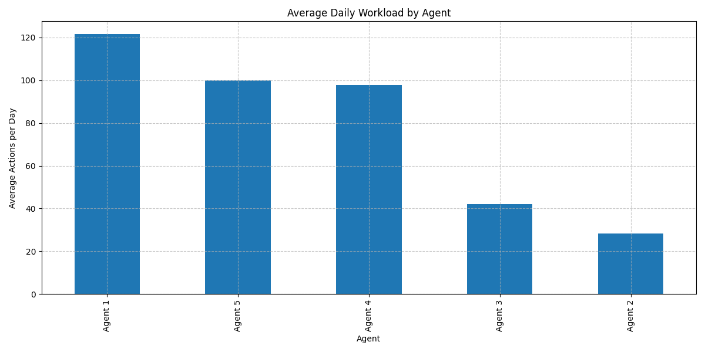
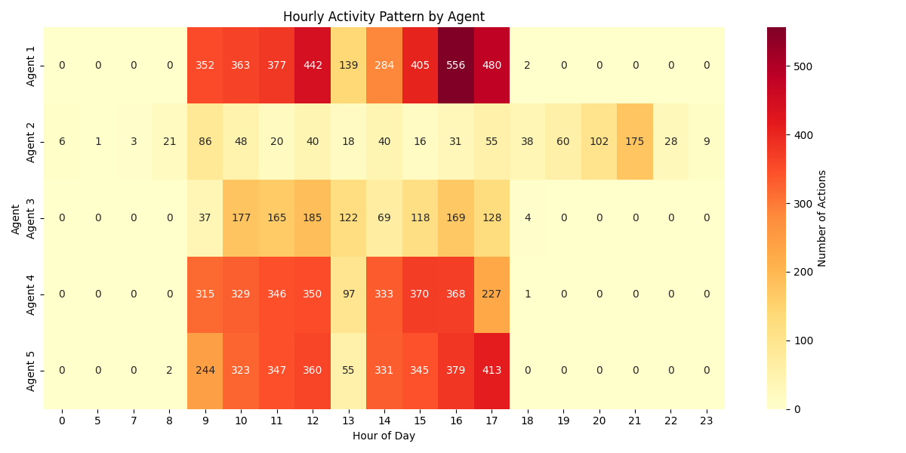
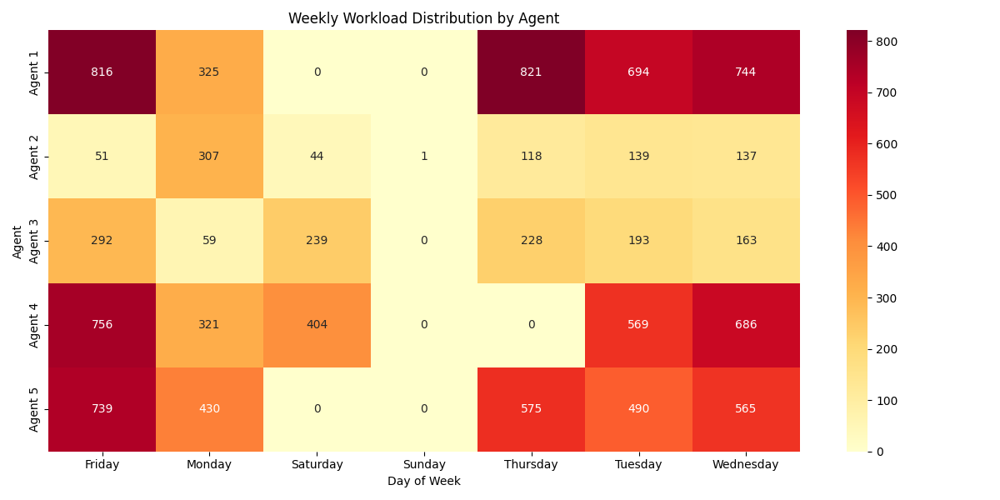
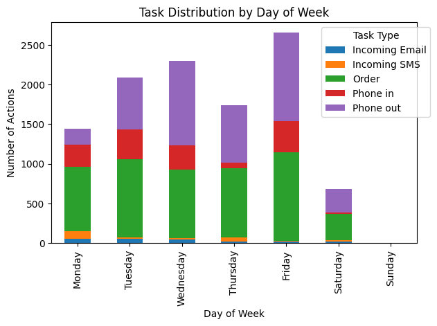
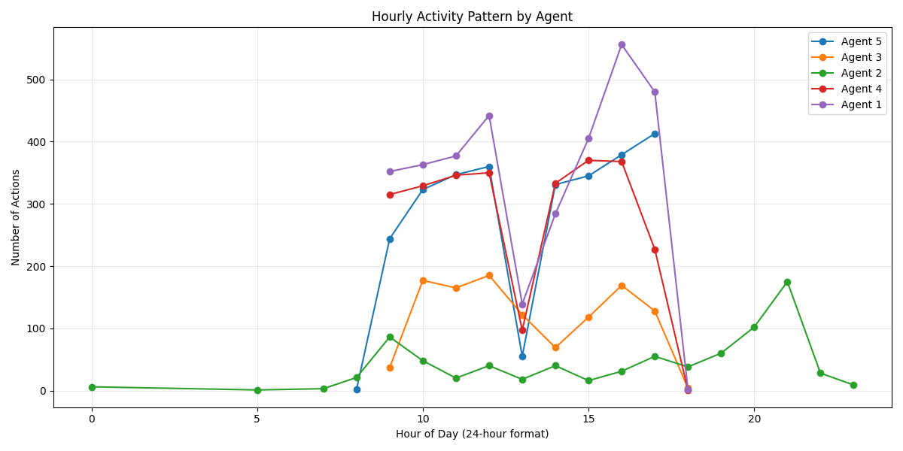
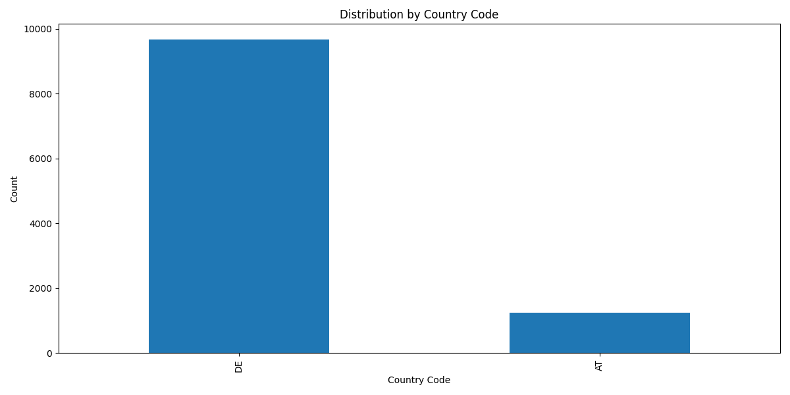

# Kundenservice-Operationsanalyse

---

## Slide 1: Titelfolie 🎯

### Kundenservice-Operationsanalyse
#### Zeitraum: 15. September - 15. Oktober 2022

---

## Slide 2: Übersicht 📊

### Zusammenfassung der Analyse
- **Gesamtinteraktionen**: 10.906
- **Anzahl der Agenten**: 5
- **Analysezeitraum**: 30 Tage

---

## Slide 3: Tägliche Muster 📈

### Arbeitsbelastung im Tagesverlauf


#### Kennzahlen:
- Durchschnitt: 389,5 Interaktionen/Tag
- Maximum: 801 Interaktionen (28. Sept)
- Minimum: 1 Interaktion (18. Sept)

---

## Slide 4: Stündliches Aktivitätsmuster 🕒

### Aktivitätsverteilung über 24 Stunden


#### Hauptzeiten:
- **Morgenpeak**: 12:00 Uhr (Bestellungen)
- **Nachmittagspeak**: 15:00-17:00 Uhr (Anrufe)
- **Abendaktivität**: 21:00 Uhr (Schriftverkehr)

---

## Slide 5: Wöchentliche Arbeitsbelastung 📅

### Wöchentliche Verteilung


#### Erkenntnisse:
- Freitag ist der geschäftigste Tag
- Deutliche Unterschiede zwischen Werktagen und Wochenenden
- Regelmäßige Wochenmuster erkennbar

---

## Slide 6: Aufgabenverteilung 📊

### Verteilung nach Aufgabentyp


#### Prozentuale Aufteilung:
```
Bestellungen    ████████████░░░░░░░░░ 45,8%
Ausgehende      ████████████░░░░░░░░░ 37,1%
Eingehende      ████░░░░░░░░░░░░░░░░ 13,2%
SMS             █░░░░░░░░░░░░░░░░░░░  2,0%
E-Mail          █░░░░░░░░░░░░░░░░░░░  1,9%
```

---

## Slide 7: Spitzenzeiten-Analyse ⏰

### Analyse der aktivsten Zeiten


#### Haupterkenntnisse:
- Höchste Aktivität: 12:00-17:00 Uhr
- Deutliche Mittagsspitze
- Abendliches Aktivitätsmuster

---

## Slide 8: Geografische Verteilung 🌍

### Kundenverteilung nach Regionen


---

## Slide 9: Agent Performance 👥

### Leistungsübersicht der Agenten

| Agent | Aktionen | Hauptaufgaben |
|-------|----------|---------------|
| Agent 1 | 3.400 | 52,7% Ausgehende Anrufe |
| Agent 2 | 797 | 49,7% SMS |
| Agent 3 | 1.850 | 100% Bestellungen |
| Agent 4 | 2.100 | Ausgewogen |
| Agent 5 | 2.759 | 86,9% Ausgehende Anrufe |

---

## Slide 10: Optimierungsvorschläge ✨

### 1. Arbeitsausgleich
- Umverteilung der Aufgaben
- Rotationssystem einführen
- Lastausgleich implementieren

### 2. Zeitplanoptimierung
- Stoßzeiten-Besetzung erhöhen
- Schichtplan anpassen
- Flexible Arbeitszeiten

### 3. Kompetenzentwicklung
- Übergreifende Schulungen
- Backup-Fähigkeiten
- Leistungsmonitoring

---

## Slide 11: Fazit 🎯

### Haupterkenntnisse
- Deutliche Arbeitsbelastungsunterschiede
- Klare Zeitliche Muster
- Spezialisierungspotenzial

### Nächste Schritte
1. Aufgabenverteilung optimieren
2. Zeitpläne anpassen
3. Team weiterentwickeln
