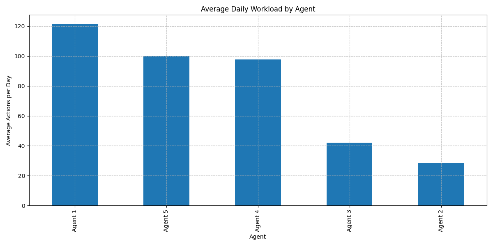
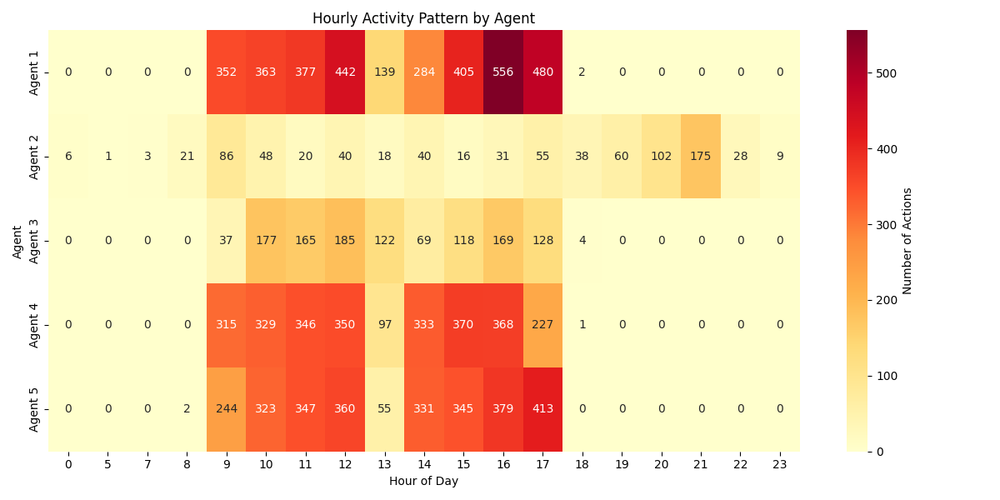
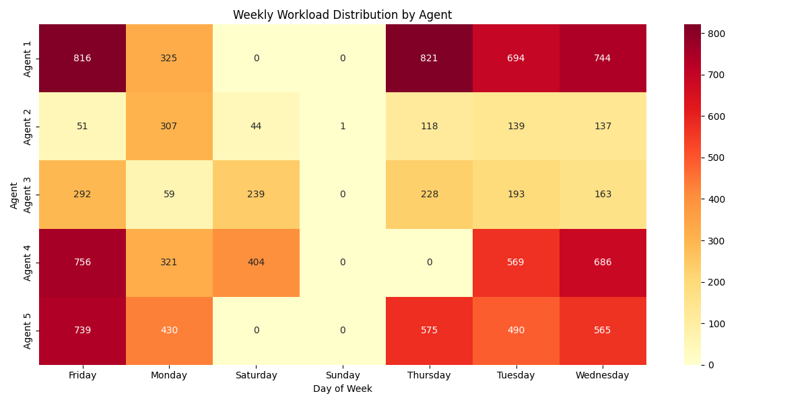
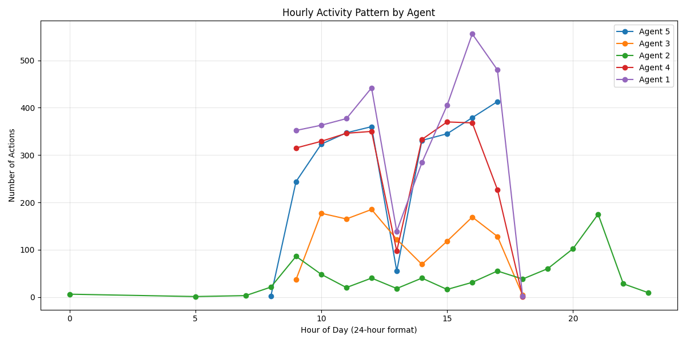
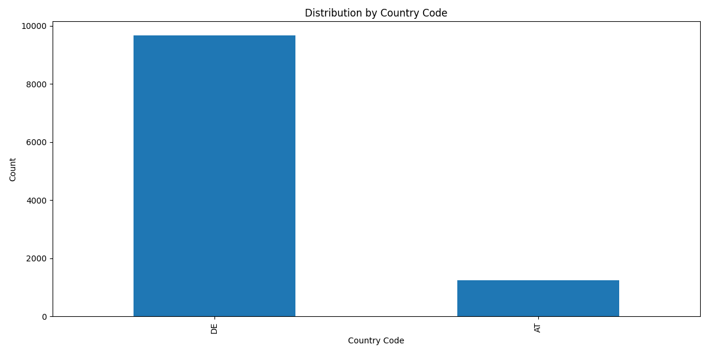

# Kundenservice-Operationsanalyse

---

## Slide 1: Titelfolie 🎯

### Kundenservice-Operationsanalyse
#### Zeitraum: 15. September - 15. Oktober 2022

---

## Slide 2: Übersicht 📊

### Zusammenfassung der Analyse
- **Gesamtinteraktionen**: 10.906
- **Anzahl der Agenten**: 5
- **Analysezeitraum**: 30 Tage

#### Hauptziele
- Analyse der Kundenservice-Aktivitäten
- Identifikation von Optimierungspotentialen
- Entwicklung von Handlungsempfehlungen

---

## Slide 3: Tägliche Muster 📈

### Arbeitsbelastung im Tagesverlauf


#### Kennzahlen
- **Durchschnitt**: 389,5 Interaktionen/Tag
- **Maximum**: 801 Interaktionen (28. Sept)
- **Minimum**: 1 Interaktion (18. Sept)

---

## Slide 4: Stündliches Aktivitätsmuster 🕒

### Aktivitätsverteilung über 24 Stunden


#### Hauptzeiten
- **Morgenpeak**: 12:00 Uhr (Bestellungen)
- **Nachmittagspeak**: 15:00-17:00 Uhr (Anrufe)
- **Abendaktivität**: 21:00 Uhr (Schriftverkehr)

---

## Slide 5: Wöchentliche Arbeitsbelastung 📅

### Wöchentliche Verteilung


#### Erkenntnisse
- Freitag ist der geschäftigste Tag
- Deutliche Unterschiede zwischen Werktagen und Wochenenden
- Regelmäßige Wochenmuster erkennbar

---

## Slide 6: Aufgabenverteilung 📋

### Verteilung nach Aufgabentyp


#### Prozentuale Aufteilung
```
Bestellungen    ████████████░░░░░░░░░ 45,8% (4.990)
Ausgehende      ████████████░░░░░░░░░ 37,1% (4.050)
Eingehende      ████░░░░░░░░░░░░░░░░ 13,2% (1.443)
SMS             █░░░░░░░░░░░░░░░░░░░  2,0% (218)
E-Mail          █░░░░░░░░░░░░░░░░░░░  1,9% (205)
```

---

## Slide 7: Spitzenzeiten-Analyse ⏰

### Analyse der aktivsten Zeiten


#### Haupterkenntnisse
- Höchste Aktivität: 12:00-17:00 Uhr
- Deutliche Mittagsspitze
- Abendliches Aktivitätsmuster
- Wichtig für Personalplanung

---

## Slide 8: Geografische Verteilung 🌍

### Kundenverteilung nach Regionen


#### Verteilungsmuster
- Internationale Reichweite
- Regionale Schwerpunkte
- Sprachliche Anforderungen

---

## Slide 9: Agent Performance 👥

### Leistungsübersicht der Agenten

| Agent | Aktionen | Hauptaufgaben | Besonderheiten |
|-------|----------|---------------|----------------|
| Agent 1 | 3.400 | Ausgehende Anrufe (52,7%) | Höchste Arbeitsbelastung |
| Agent 2 | 797 | SMS (49,7%) | Niedrigste Arbeitsbelastung |
| Agent 3 | 1.850 | Bestellungen (100%) | Spezialisiert |
| Agent 4 | 2.100 | Gemischt | Ausgewogenes Profil |
| Agent 5 | 2.759 | Ausgehende Anrufe (86,9%) | Fokussiert |

---

## Slide 10: Optimierungsvorschläge ✨

### 1. Arbeitsausgleich
- Umverteilung der Aufgaben
- Rotationssystem einführen
- Lastausgleich implementieren

### 2. Zeitplanoptimierung
- Stoßzeiten-Besetzung erhöhen
- Schichtplan anpassen
- Flexible Arbeitszeiten

### 3. Kompetenzentwicklung
- Übergreifende Schulungen
- Backup-Fähigkeiten
- Leistungsmonitoring

---

## Slide 11: Fazit 🎯

### Haupterkenntnisse
- Deutliche Arbeitsbelastungsunterschiede
- Klare zeitliche Muster
- Spezialisierungspotenzial

### Nächste Schritte
1. Aufgabenverteilung optimieren
2. Zeitpläne anpassen
3. Team weiterentwickeln

---

## Slide 12: Fragen & Diskussion ❓

### Kontakt
- E-Mail: support@kundenservice.de
- Telefon: +49 123 456789
- Intranet: kundenservice.intern