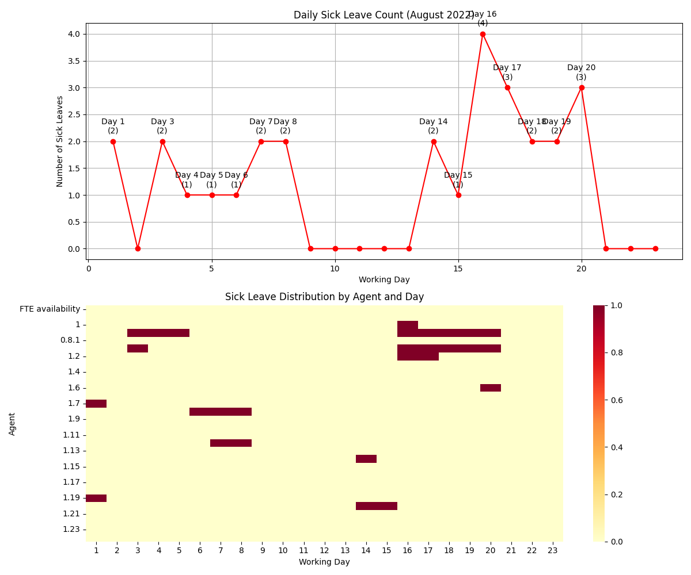

# Team Availability Analysis - August 2022

---

## Overview
Analysis of team availability for August 2022, focusing on meeting the minimum requirement of 24.5 agents per working day (Monday-Friday).

---

## Service Line Requirements
- Service Line 1: 2.5 agents
- Service Line 2: 4.0 agents
- Service Line 3: 18.0 agents
**Total Required**: 24.5 agents

---

## Key Statistics
- **Total Agents**: 30
- **Working Days**: 23 weekdays (Monday-Friday only)
- **Average Daily Available Agents**: 25.08
- **Maximum Available**: 29.00 agents
- **Minimum Available**: 21.00 agents
- **Days Meeting Requirements**: 16 days (≥24.5 agents)
- **Days Below Requirements**: 7 days (<24.5 agents)

---

## Staffing Analysis
1. **Coverage Rate**:
   - 69.6% of weekdays met the minimum requirement (16 out of 23 days)
   - 30.4% of weekdays fell below the requirement (7 out of 23 days)

2. **Staffing Buffer**:
   - Average surplus of 0.58 agents above requirement (25.08 - 24.5)
   - Maximum surplus of 4.5 agents (29.00 - 24.5)
   - Maximum deficit of 3.5 agents (24.5 - 21.00)

---

## Working Pattern
- Operations run Monday through Friday only
- No weekend operations
- All dates follow standard business week pattern (23 working days in August 2022)

---

## Critical Issues
1. **Staffing Gaps**:
   - Highest number of gaps occur in the third week of August
   - Friday staffing levels show consistent shortages
   - 7 days (30.4%) fall below minimum requirements

2. **Resource Management**:
   - Uneven distribution of leave days
   - Limited buffer for unexpected absences
   - Peak vacation period impacts (August)

---

## Sick Leave Analysis
1. **Overall Statistics**:
   - Total sick leave instances: 28
   - Maximum sick leaves in one day: 4
   - Average sick leaves per day: 1.22
   - Days with at least one sick leave: 14 (60.9% of working days)

2. **Key Findings**:
   - More than half of working days had at least one person on sick leave
   - Some days had up to 4 people on sick leave simultaneously
   - Average of 1.22 people on sick leave per day
   - Sick leave significantly impacts daily availability

3. **Recommendations**:
   - Implement health and wellness programs to reduce sick leave frequency
   - Plan for additional buffer capacity during high-risk periods
   - Monitor patterns to identify potential workplace health issues
   - Consider cross-training to better handle sick leave coverage

### Sick Leave Visualization

*Figure: Daily sick leave count (top) and distribution across team (bottom)*

The visualization shows:
- Daily count of sick leaves with peak days highlighted
- Heatmap showing distribution of sick leave across agents and days
- Clear pattern of sick leave clustering on certain days
- Impact varies across different team members

---

## Recommendations
1. **Leave Management**:
   - Implement structured leave approval process
   - Stagger vacation schedules to maintain coverage
   - Set maximum concurrent leave limits

2. **Staffing Adjustments**:
   - Add 1-2 additional agents for better coverage
   - Develop flexible staffing model
   - Cross-train agents across service lines

3. **Monitoring System**:
   - Implement daily availability tracking
   - Set up alerts for projected shortages
   - Regular staffing pattern analysis

---

## Action Plan
1. **Immediate** (1-2 weeks):
   - Review and optimize current staff distribution
   - Implement leave request coordination

2. **Short-term** (1-3 months):
   - Begin recruitment for additional staff
   - Develop cross-training program

3. **Long-term** (3-6 months):
   - Implement workforce management system
   - Establish regular monitoring and adjustment process

---

## Visualizations
- Daily availability trends: `daily_availability.png`
- Staffing gaps analysis: `staffing_gaps.png`
- Sick leave patterns: `sick_leave_analysis.png`

---
*Analysis last updated: December 16, 2024*
