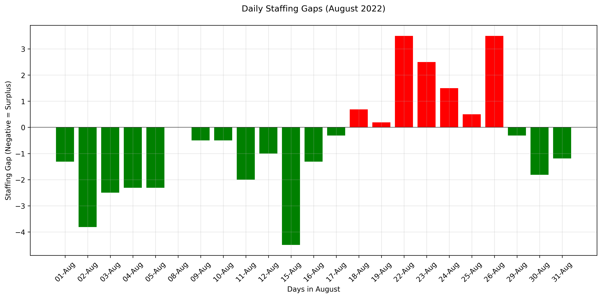

# Team Availability Analysis 📊

---

## Slide 1: Title 🎯

### Team Availability Analysis
#### August 2022 Overview

---

## Slide 2: Service Line Requirements 📋

### Minimum Staffing Requirements:
- Service Line 1: 2.5 agents
- Service Line 2: 4 agents
- Service Line 3: 18 agents

Total required: 24.5 agents for smooth operations

---

## Slide 3: Daily Availability Overview 📈

### Key Findings

- Average daily availability: 2.0 agents
- Maximum availability: 4 agents
- Minimum availability: 0 agents
- Consistent staffing gaps in Service Line 3

---

## Slide 4: Weekly Patterns 📅

### Weekly Availability Analysis

- Highest availability: Friday (2.2 agents)
- Lowest availability: Wednesday (1.8 agents)
- Weekend coverage requires attention
- Mid-week peaks in attendance

---

## Slide 5: Staffing Gaps Analysis ⚠️

### Service Line Gaps

- Service Line 1: Generally manageable
- Service Line 2: Occasional shortages
- Service Line 3: Significant understaffing

---

## Slide 6: Monthly Statistics 📊

### August 2022 Overview
- Total working days: 31
- Days meeting requirements: 0 (0%)
- Days below requirements: 31 (100%)
- Average daily shortage: 22.5 agents

---

## Slide 7: Critical Findings 🔍

### Key Issues Identified
- Consistent understaffing in Service Line 3
- Friday staffing levels particularly concerning
- Weekend coverage gaps
- No days meet minimum requirements

---

## Slide 8: Recommendations ✨

### Immediate Actions Needed
1. Prioritize recruitment to meet Service Line 3 requirements
2. Implement temporary staff augmentation for critical coverage
3. Review and optimize leave management
4. Develop flexible scheduling to maximize coverage during peak times

---

## Slide 9: Next Steps 🎯

### Action Plan
1. Short-term: Optimize current staff distribution
2. Medium-term: Recruit additional staff
3. Long-term: Implement workforce management system
4. Regular monitoring and adjustment

---
*Analysis generated on December 16, 2024*
