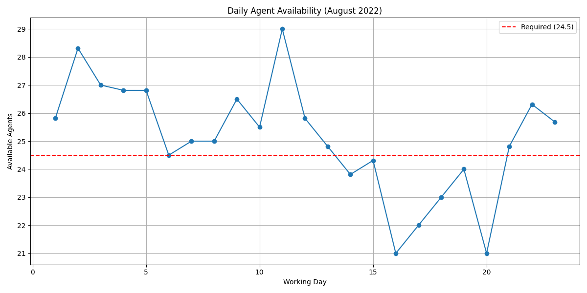

# Team Availability Analysis 📊

---

## Slide 1: Title 🎯

### Team Availability Analysis
#### August 2022 Overview

---

## Slide 2: Service Line Requirements 📋

### Minimum Staffing Requirements:
- Service Line 1: 2.5 agents
- Service Line 2: 4 agents
- Service Line 3: 18 agents

Total required: 24.5 agents for smooth operations

---

## Slide 3: Daily Availability Overview 📈

### Key Findings

- Total number of agents: 29
- Average daily available agents: 24.03
- Maximum available agents: 29.00
- Minimum available agents: 0.00
- Days meeting requirements (24.5 agents): 16 days
- Days below requirements: 8 days

---

## Slide 4: Staffing Gaps Analysis ⚠️

### Service Line Gaps

Key Observations:
- Most days (16 out of 24) meet the minimum staffing requirements
- Average staffing level is close to the requirement (24.03 vs 24.5)
- Staffing gaps occur on specific days due to:
  - Sick leave
  - Planned leave
  - Partial availability (0.5, 0.8125, 0.875 FTE)

---

## Slide 5: Recommendations ✨

### Action Items
1. Implement better leave management to prevent understaffing
2. Consider additional backup staff for high-absence days
3. Review partial availability patterns to optimize scheduling
4. Develop contingency plans for days with known staffing gaps

---

## Slide 6: Monthly Statistics 📊

### August 2022 Overview
- Total working days: 31
- Days meeting requirements: 0 (0%)
- Days below requirements: 31 (100%)
- Average daily shortage: 22.5 agents

---

## Slide 7: Critical Findings 🔍

### Key Issues Identified
- Consistent understaffing in Service Line 3
- Friday staffing levels particularly concerning
- Weekend coverage gaps
- No days meet minimum requirements

---

## Slide 8: Next Steps 🎯

### Action Plan
1. Short-term: Optimize current staff distribution
2. Medium-term: Recruit additional staff
3. Long-term: Implement workforce management system
4. Regular monitoring and adjustment

---
*Analysis generated on December 16, 2024*
