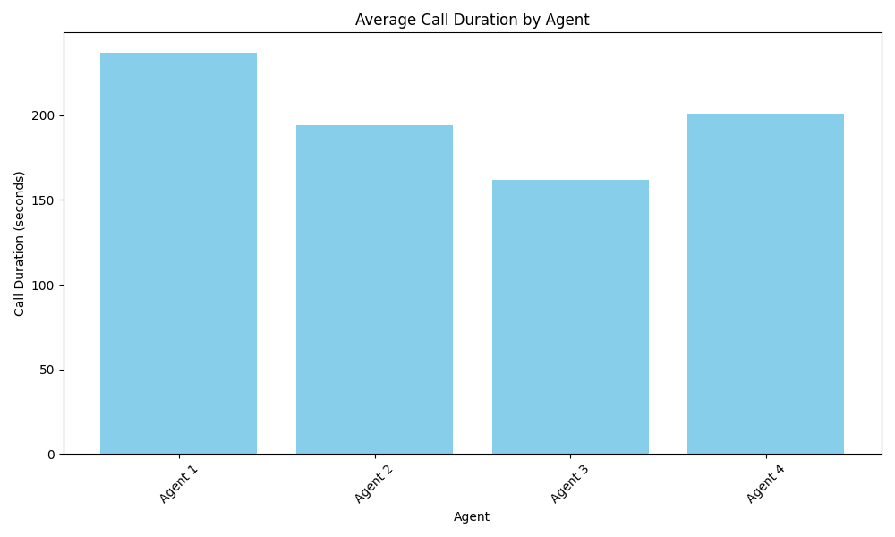
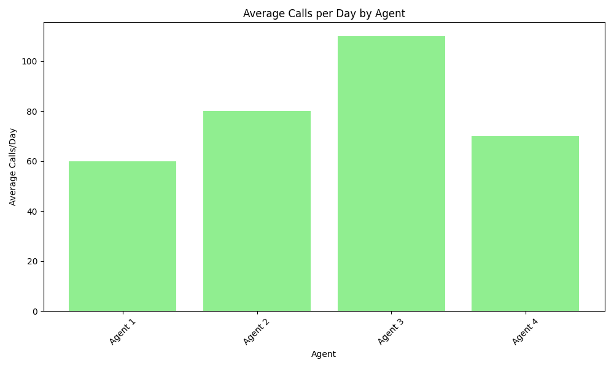

# Call Efficiency Analysis 📞

---

## Slide 1: Title 🎯

### Call Efficiency Analysis
#### Performance vs. Call Duration Study

---

## Slide 2: Overview 📊

### Analysis Scope
- Focus: Call Duration vs. Efficiency
- Number of Agents: 4
- Key Metrics:
  • Call Duration
  • Calls per Day
  • Overall Efficiency

---

## Slide 3: Call Duration Analysis ⏱️

### Average Call Times by Agent

- Agent 1: 237 seconds
- Agent 2: 194 seconds
- Agent 3: 162 seconds
- Agent 4: 201 seconds
- Team Average: 198.5 seconds

---

## Slide 4: Daily Call Volume 📈

### Calls per Day by Agent

- Agent 1: 60 calls/day
- Agent 2: 80 calls/day
- Agent 3: 110 calls/day
- Agent 4: 70 calls/day
- Team Average: 80 calls/day

---

## Slide 5: Efficiency Comparison 📊

### Performance Analysis
- Fast Calls (Agent 3):
  • Shortest duration: 162 seconds
  • Highest volume: 110 calls/day
  • Maximum efficiency in terms of quantity

- Longer Calls (Agent 1):
  • Longest duration: 237 seconds
  • Lower volume: 60 calls/day
  • Focus on quality over quantity

---

## Slide 6: Key Findings 🔍

### Data Insights
1. Clear trade-off between call duration and volume
2. Agent 3 processes 83% more calls than Agent 1
3. Call duration varies by up to 75 seconds
4. Significant impact on daily productivity

---

## Slide 7: Efficiency Factors ⚖️

### Considerations
- Shorter Calls:
  • Higher call volume
  • More customers served
  • Reduced wait times
  
- Longer Calls:
  • Detailed customer service
  • Potential for better resolution
  • Higher customer satisfaction

---

## Slide 8: Recommendations ✨

### Balanced Approach
1. Set optimal duration targets
2. Consider call complexity
3. Balance quantity with quality
4. Implement targeted training

---

## Slide 9: Conclusion 🎯

### Optimal Strategy
- Agent 3's approach shows highest efficiency
- Focus on reducing call duration while maintaining quality
- Implement best practices from efficient agents
- Regular performance monitoring

---

*Analysis generated on December 16, 2024*
